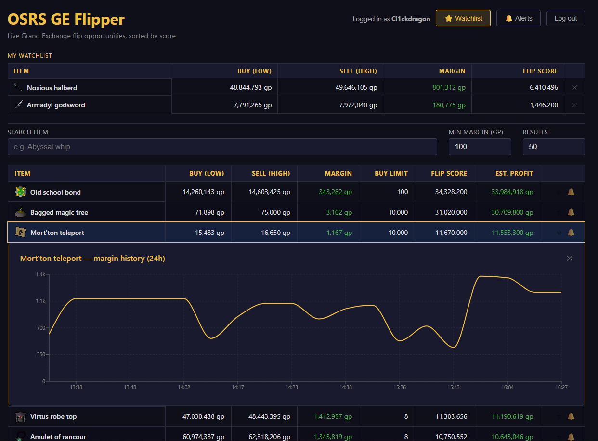

# OSRS GE Flipper

A full-stack Grand Exchange flipping assistant for Old School RuneScape. Live prices are fetched from the [OSRS Wiki Prices API](https://prices.runescape.wiki/api/v1/osrs), scored by flip potential, and updated every 5 minutes — giving players an edge in identifying profitable trades in real time.

**[Live demo →](https://osrs-ge-flipper.onrender.com)**



---

## Features

### Market data
- **Live flip scores** — every item ranked by `margin × buy limit`, using 5-minute volume-weighted average prices rather than single-transaction outliers
- **Price history charts** — click any item to see its margin trend over the last 24 hours, powered by a background job that snapshots the top 100 items every 5 minutes
- **Full-catalogue search** — debounced search across the entire OSRS item catalogue; matching items are pinned above the main rankings so you always see both your result and the wider market

### Accounts
- **JWT authentication** — register and log in; tokens are signed with HMAC-SHA256 and validated stateless on every request
- **Watchlist** — save items to a personal list; current prices are enriched on every fetch so your watchlist is always live
- **Price alerts** — set a margin target for any item; the snapshot job checks all active alerts after each run and marks any that have been hit; triggered alerts surface as a notification badge and can be dismissed or deleted without losing the alert

### Security & quality
- **Rate limiting** — login capped at 5 attempts per minute per IP, register at 3, using the token-bucket algorithm (Bucket4j)
- **Input validation** — all request bodies validated with Jakarta Bean Validation before reaching service logic
- **User-scoped data** — watchlist and alert endpoints are JWT-protected; all queries are scoped to the authenticated user, preventing cross-user data access
- **Registered user count** — live member count displayed in the header, served from a public `GET /api/stats` endpoint

---

## Tech stack

| Layer | Technology |
|---|---|
| Backend | Java 21, Spring Boot 3.2 |
| Database | PostgreSQL 16, Flyway migrations |
| Auth | JWT / HMAC-SHA256, Spring Security OAuth2 Resource Server |
| Rate limiting | Bucket4j (token bucket, in-memory) |
| Scheduler | Spring `@Scheduled` |
| Frontend | React 18, TypeScript, Vite |
| Charts | Recharts |
| API docs | OpenAPI 3 / Swagger UI |
| CI/CD | GitHub Actions |
| Containers | Docker, Docker Compose |
| Deployment | Render |

---

## Quick start

Requires [Docker Desktop](https://www.docker.com/products/docker-desktop).

```bash
git clone https://github.com/Cl1ckDragon/osrs-ge-flipper.git
cd osrs-ge-flipper
cp .env.example .env
docker compose up --build
```

| Service | URL |
|---|---|
| Frontend | http://localhost:5173 |
| Backend API | http://localhost:8080 |
| Swagger UI | http://localhost:8080/swagger-ui.html |

No other local dependencies required — the database, backend, and frontend all run in containers.

---

## Architecture

```
Browser
  │
  ▼
nginx  ──  serves React build
  │        proxies /api/* → backend
  ▼
Spring Boot
  │
  ├── GET  /api/prices                 live flip opportunities (public)
  ├── GET  /api/prices/search          full-catalogue item search (public)
  ├── GET  /api/prices/history/:id     24h margin history (public)
  ├── POST /api/auth/register          create account
  ├── POST /api/auth/login             issue JWT
  ├── GET  /api/stats                  registered user count (public)
  ├── GET/POST/DELETE /api/watchlist   saved items (JWT required)
  └── GET/POST/DELETE/PATCH /api/alerts  price alerts (JWT required)
  │
  ▼
PostgreSQL
  ├── users
  ├── price_snapshots   ← written every 5 min by @Scheduled job
  ├── watchlist_items
  └── price_alerts      ← checked against live prices on each snapshot
```

The backend follows a deliberate layered architecture: controllers are thin (validation and HTTP only), business logic lives in services, and the `FlipScoreCalculator` is a pure `@Component` with no Spring dependencies — making it directly unit-testable without mocking.

---

## Database migrations

Schema is managed by Flyway and applied automatically on startup:

| Migration | Description |
|---|---|
| `V1` | `price_snapshots` table |
| `V2` | `users` table |
| `V3` | `watchlist_items` and `price_alerts` tables |

---

## API documentation

Interactive Swagger UI — try every endpoint directly from the browser:

**[https://osrs-ge-flipper-api.onrender.com/swagger-ui.html](https://osrs-ge-flipper-api.onrender.com/swagger-ui.html)**

---

## Testing

```bash
cd backend && mvn test
```

| Test class | What it covers |
|---|---|
| `FlipScoreCalculatorTest` | Score formula, GE tax, integer overflow with large values (7 tests) |
| `PriceServiceTest` | Sort order, margin filter, null price handling, buy limit filter, limit cap, missing mappings (6 tests) |
| `UserServiceTest` | Register/login happy paths, conflict detection, BCrypt hashing verified via `ArgumentCaptor`, dedicated security test asserting both login failure modes return identical messages to prevent username enumeration (8 tests) |
| `AuthRateLimitInterceptorTest` | Bucket capacity per endpoint, independent buckets per IP, `X-Forwarded-For` header handling, non-auth paths unaffected (5 tests) |

---

## Known limitations

- **Rate limiting is in-memory** — token buckets reset on restart and are not shared across instances. Bucket4j has built-in Redis support for a production multi-instance deployment.
- **Alert delivery is in-app only** — triggered alerts surface in the UI. Email or push notification delivery is not implemented.
- **Render free tier cold starts** — the backend spins down after 15 minutes of inactivity; the first request after sleep takes ~30 seconds.
- **Price snapshots require uptime** — history charts only reflect periods when the app was running. There is no historical backfill on startup.
